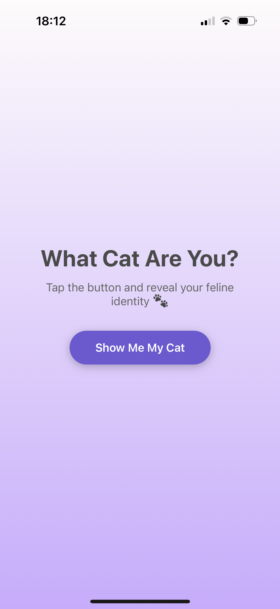
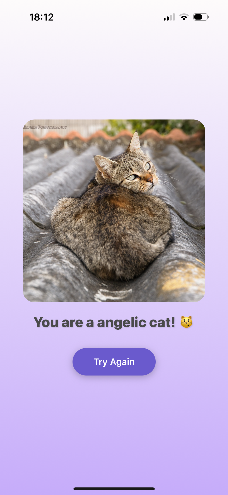
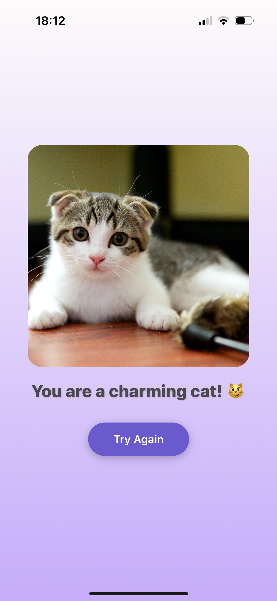
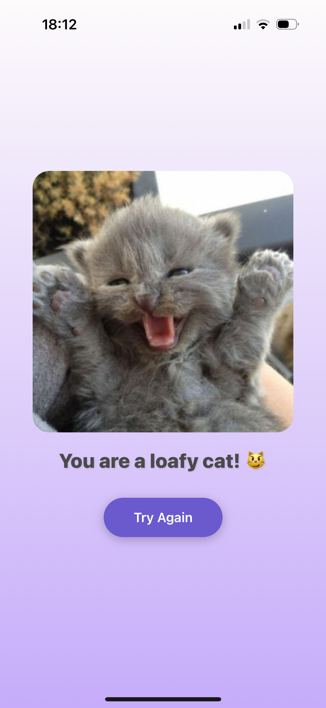
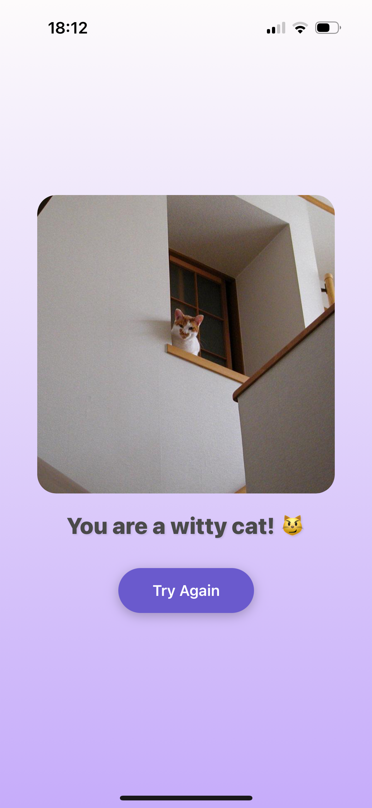
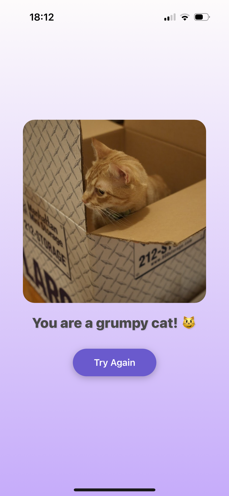
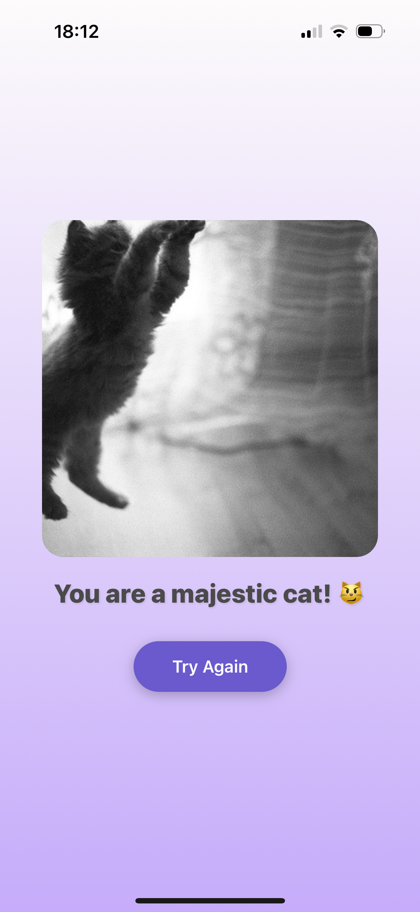

# 🐱 What Cat Are You? – React Native App

Discover your inner feline! "What Cat Are You?" is a fun, playful mobile app built with **React Native**. Just tap a button and get a random cat image — plus a fun personality to match. 😼

---

## 📱 Features

- 🐾 Random cat image generator (via [The Cat API])
- ✨ Know yourself: Funny and cute personality traits
- 🔁 “Try Again” button for endless fun
- 📦 Built with TypeScript and React Native

---

## 📸 Demo

Here’s how the app looks in action:

### 🏠 Home Screen  

    

### 🐱 Result Screens (examples)  

  
  
  
  
  
  

